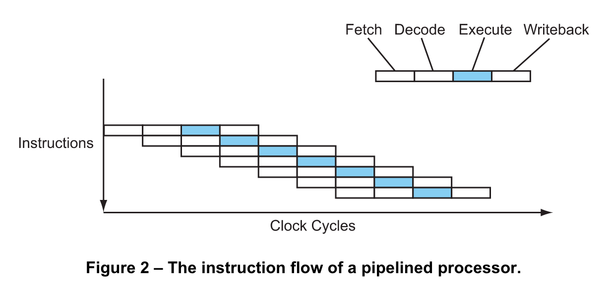

## 명령 흐름과 브랜치 예측(Instruction Flow and Branch Predictions)

HW가 어떻게 동작하는지 이해하는 것이 중요합니다. 왜냐하면 대부분의 성능 좋은 코드를 작성하는 방법을 이해하는 것과 같기 때문입니다. 프로세서 캐싱의 기본을 알고 있다면 관용적 표현 코드를 작성하는 범위내에서 더 나은 결정을 할 수 있기 때문입니다.

## Acknowledgment
This content is provided by Lighterra, the software company of Jason Robert Carey Patterson. They work on a variety of software, including a cutting-edge code optimizer to make programs faster, a threading library for parallel programming, an iPhone user-interface library and a web video component.

[Modern Microprocessors](http://www.lighterra.com/papers/modernmicroprocessors/)

## Notes

* 각 명령은 4개 스테이지 상에서 4개 사이클을 가진다.(Fetch, Decode, Execute, Writebakc)
* 파이프라인은 이 스테이지들이 각 스테이지들이 겹치도록 해서 동시에 일어나도록 한다. 
* 브랜치는 파이프라인이 효과적으로 실행되도록 유지하기 위해 예측이 필요하다.
* Barch의 예측착오는 많은 성능 문제를 야기한다.

### 기본 명령 흐름
명령은 프로세서내부에서 순차적으로 하나씩 실행될까? 이렇게 이해하기 쉽지만 현실은 그렇지 않다. 사실 1980년대 중반까지 그렇지 않았다. 대신에 여러 명령들이 모두 부분적으로 동시에 실행되었다.

명령이 어떻게 실행되는지 곰곰히 생각해보자. - 먼저 fetch하고 decode하고 난 후에 적절한 기능 유닛에서 실행하고 마지막으로 그 결과를 특정 장소에 기록한다. 이런 개념으로 단순한 프로세서는 명령당 4개 사이클을 가진다.(CPI = 4)...

Modern processors overlap these stages in a pipeline, like an assembly line. While one instruction is executing, the next instruction is being decoded, and the one after that is being fetched...

Now the processor is completing 1 instruction every cycle (CPI = 1). This is a four-fold speedup without changing the clock speed at all. Not bad, huh?

### Basic Branch Prediction
A key problem of pipelining is branches. Consider the following code sequence...

	01 if (a > 7) {
	02    b = c;
	03 } else {
	04    b = d;
	05 }

Now consider a pipelined processor executing this code sequence. By the time the conditional branch at line 01 reaches the execute stage in the pipeline, the processor must have already fetched and decoded the next couple of instructions. But which instructions? Should it fetch and decode the if branch (line 02) or the else branch (line 04)? It won't really know until the conditional branch gets to the execute stage, but in a deeply pipelined processor that might be several cycles away. And it can't afford to just wait – the processor encounters a branch every six instructions on average, and if it was to wait several cycles at every branch then most of the performance gained by using pipelining in the first place would be lost.

So the processor must make a guess. The processor will then fetch down the path it guessed and speculatively begin executing those instructions. Of course, it won't be able to actually commit (writeback) those instructions until the outcome of the branch is known. Worse, if the guess is wrong the instructions will have to be cancelled, and those cycles will have been wasted. But if the guess is correct the processor will be able to continue on at full speed.

Nonetheless, even the very best modern processors with the best, smartest branch predictors only reach a prediction accuracy of about 95%, and still lose quite a lot of performance due to branch mispredictions.

## Links

http://www.lighterra.com/papers/modernmicroprocessors/

http://archive.arstechnica.com/cpu/1q00/crusoe/m-crusoe-1.html

## 코드 리뷰

[Tests](prediction_test.go) ([Go Playground](https://play.golang.org/p/hwZqjJNdbm))

___

___
All material is licensed under the [GNU Free Documentation License](https://github.com/ArdanStudios/gotraining/blob/master/LICENSE).