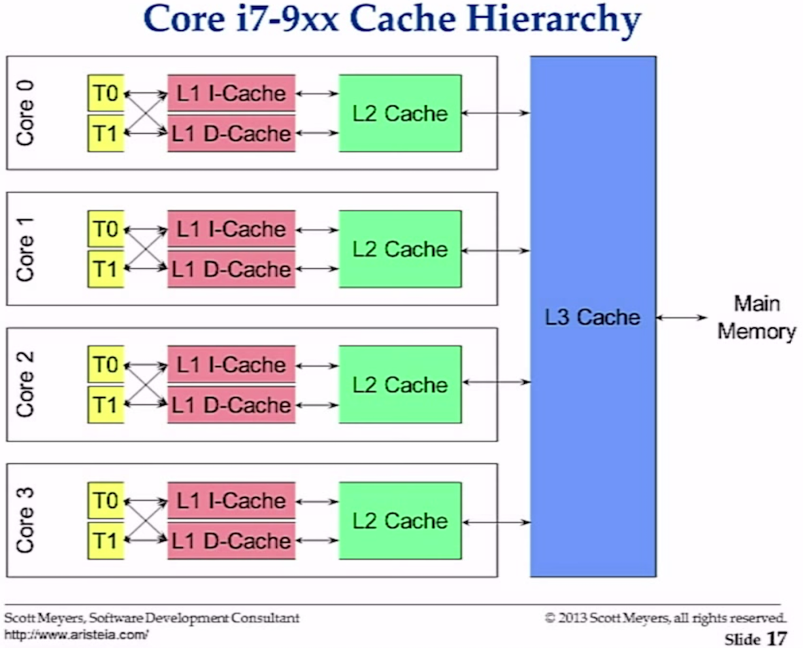

## CPU 캐시(Caches)

HW가 어떻게 동작하는지 이해하는 것이 중요합니다. 왜냐하면 대부분의 성능 좋은 코드를 작성하는 방법을 이해하는 것과 같기 때문입니다. 프로세서 캐싱의 기본을 알고 있다면 관용적 표현 코드를 작성하는 범위내에서 더 나은 결정을 할 수 있기 때문입니다.

## Acknowledgment
이 콘텐츠는 2014년 Dive에서 Scott Meyers가 한 이야기입니다 :

[CPU Caches and Why You Care](https://www.youtube.com/watch?v=WDIkqP4JbkE)

## Notes

* CPU 캐쉬는 캐쉬 라인에 캐싱된 메모리로 동작한다.
* 64 bit 프로세서에서 캐쉬 라인은 64k가 된다.
* 캐쉬 라인은 L1, L2 그리고 L3 캐쉬로 이동 및 저장된다.
* L1과 L2 캐쉬에 있는 메모리는 L3 캐쉬내도 있다.
* 데이터와 명령 모두 이 캐쉬에 저장된다.
* HW는 선형적으로 캐쉬 라인을 따라서 데이터와 명령을 돌아다닐 확률이 높다.
* 메인 메모리에 접근은 엄청 느리기 때문에 캐쉬가 필요하다.
	* 메인 메모리에서 1개 바이트에 접근은 전체 캐쉬 라인을 읽어야 한다.
	* 캐쉬 라인에 1개 바이트를 쓰기 위해서는 전체 캐쉬 라인을 필요로 한다.
* Small = Fast
	* 캐쉬에 크기가 작고 적절하게 위치한 코드가 가장 빠르다.
	* 캐쉬에 작은 자료구조를 가지는 경우 가장 빠르다.
	* 캐쉬된 데이터에만 접근하는 것이 가장 빠르다.
* 예측가능한 접근 패턴이 중요하다.
	* 일정한 메모리 접근 패턴을 제공한다.
	* HW는 필요한 메모리에 대해 더 향상된 예측이 가능하다.

### 캐쉬 계층구조

프로세서마다 다를 수 있다. 이 내용에 대해서는 Intel 4 Core i7-9xx 프로세서와 관련된 캐쉬의 멀티 레벨은 다음과 같다 :

	L1 - 64KB Cache (Per Core)
		32KB I-Cache
		32KB D-Cache
		2 HW Threads

	L2 - 256KB Cache (Per Core)
		Holds both Instructions and Data
		2 HW Threads

	L3 - 8MB Cache
		Holds both Instructions and Data
		Shared across all 4 cores
		8 HW Threads

이것은 각 코어와 메인 메모리에 대해서 캐쉬 계층의 관계도이다 :

## Links

https://www.youtube.com/watch?v=WDIkqP4JbkE

http://www.akkadia.org/drepper/cpumemory.pdf

http://www.extremetech.com/extreme/188776-how-l1-and-l2-cpu-caches-work-and-why-theyre-an-essential-part-of-modern-chips

## 코드 리뷰

[Caching](caching.go) ([Go Playground](http://play.golang.org/p/GQQXh3cf15))

[Tests](caching_test.go) ([Go Playground](http://play.golang.org/p/opI__KHj9a))

___

___
All material is licensed under the [GNU Free Documentation License](https://github.com/ArdanStudios/gotraining/blob/master/LICENSE).
